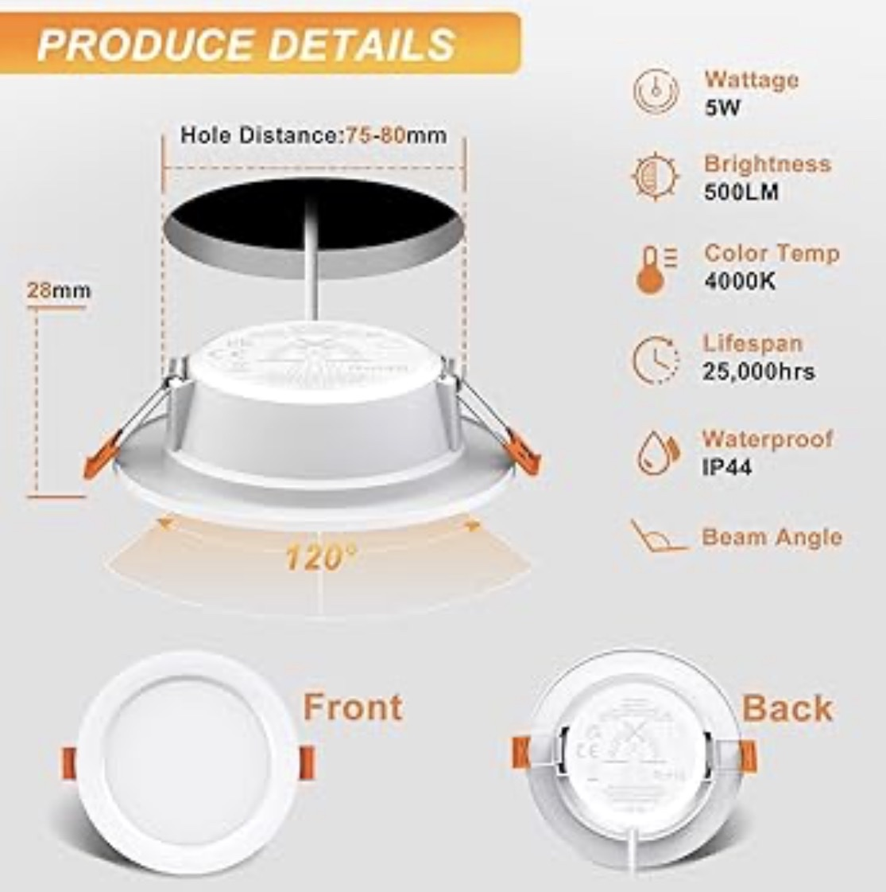
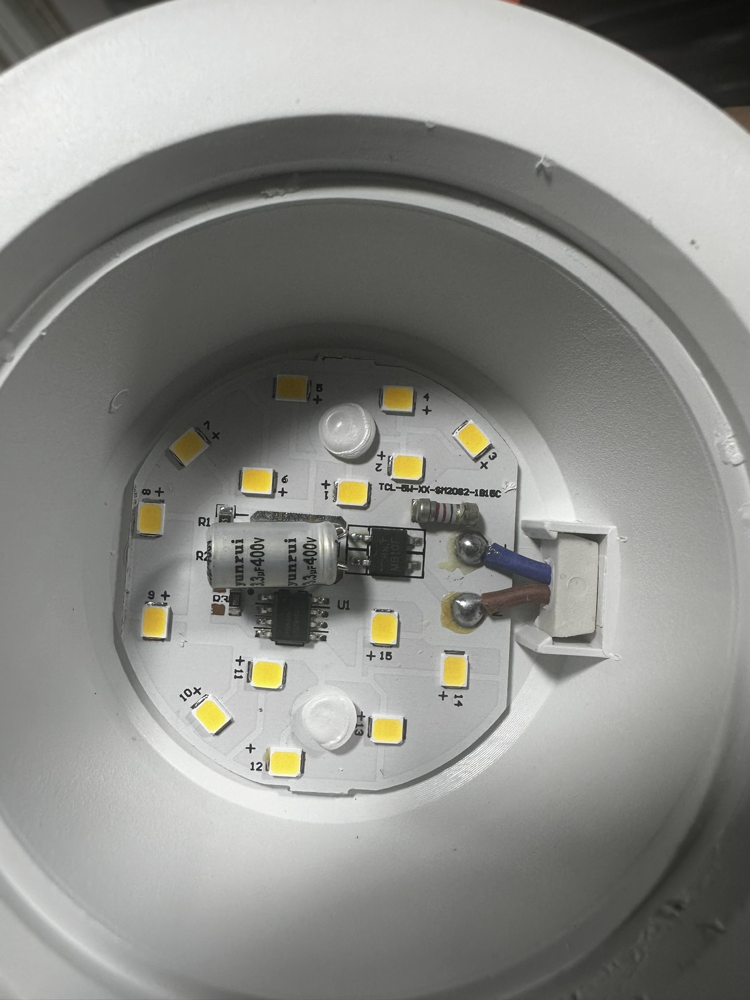
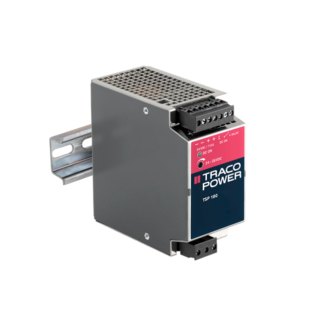
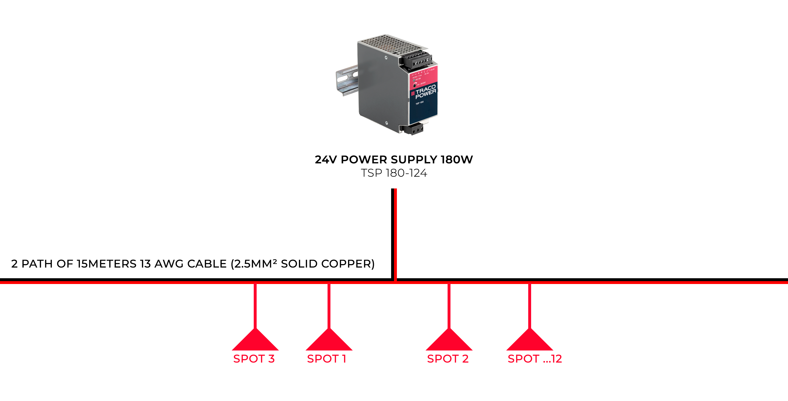
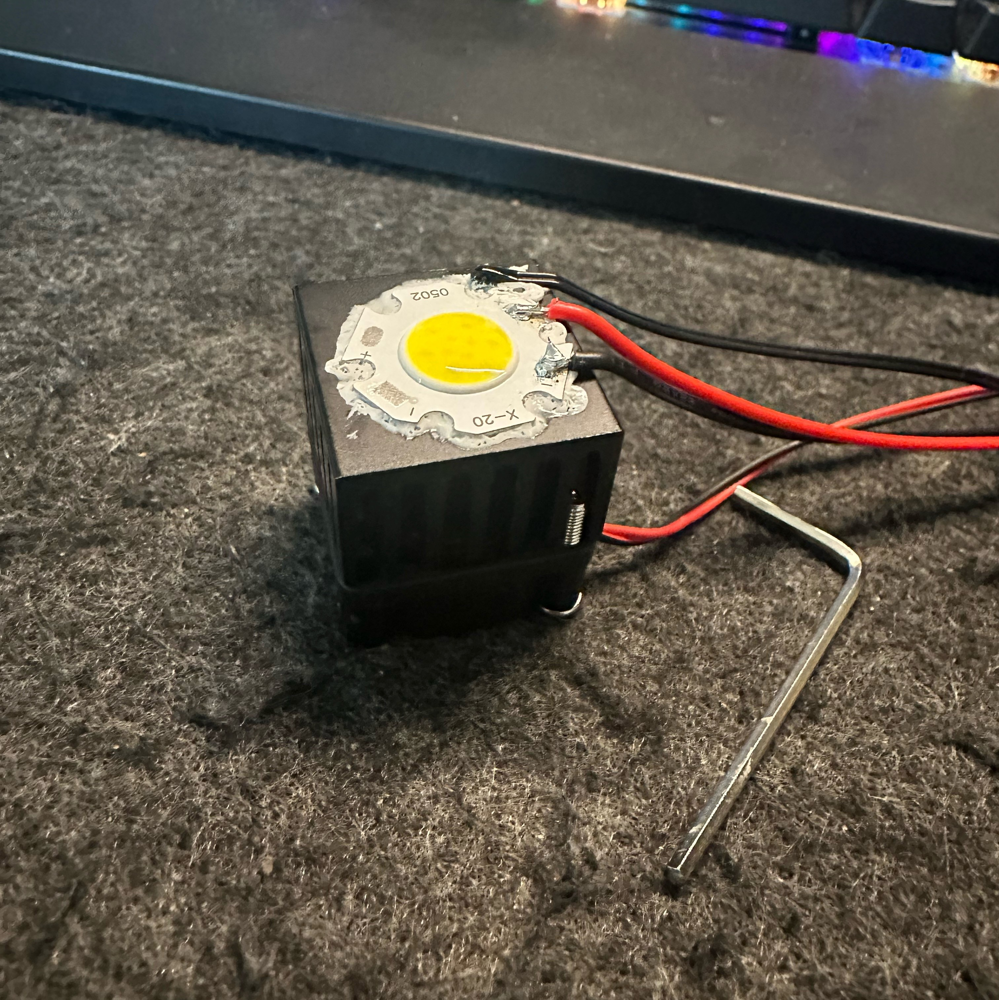
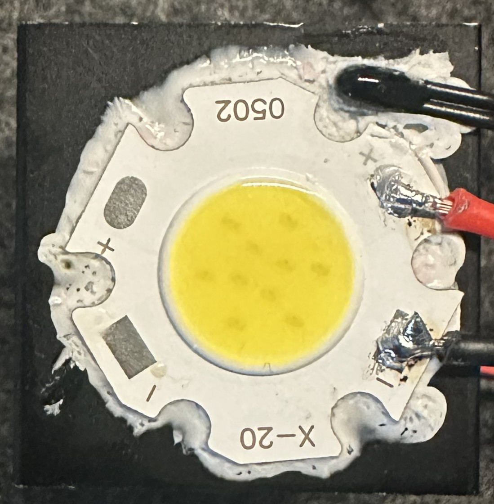
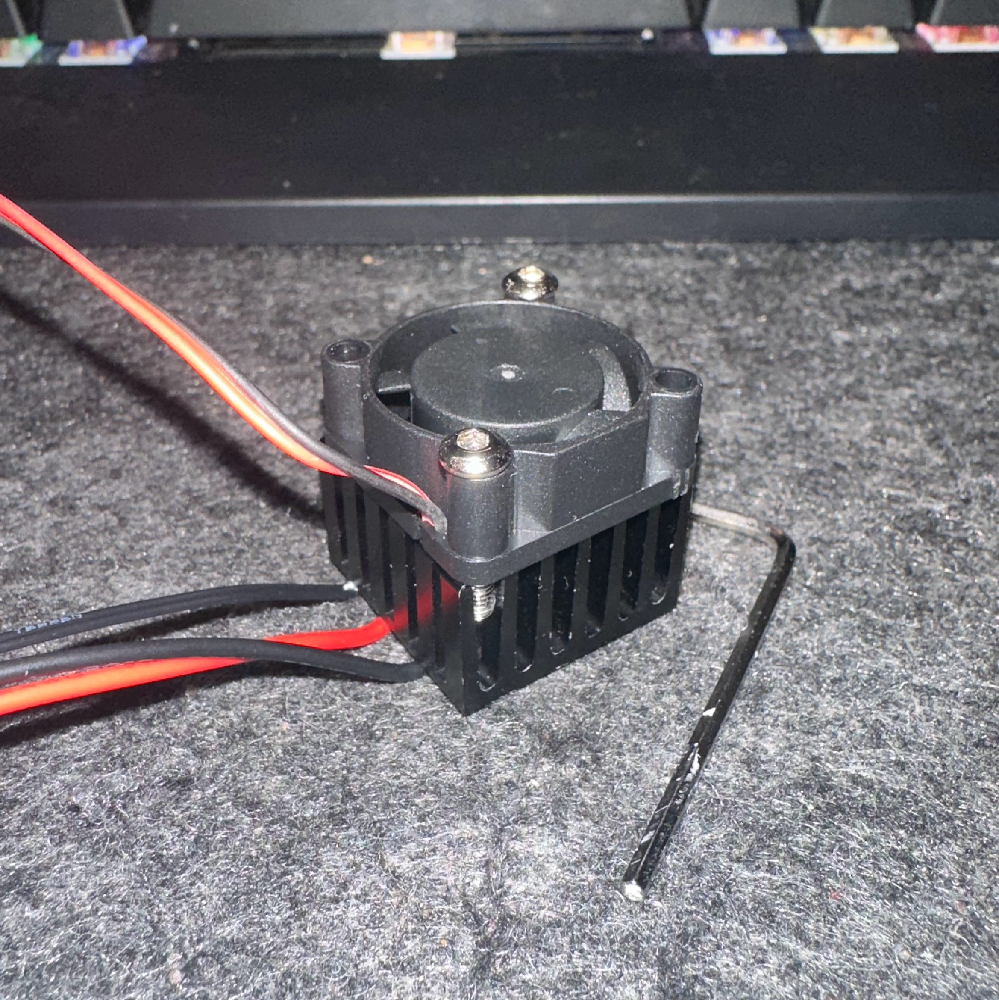
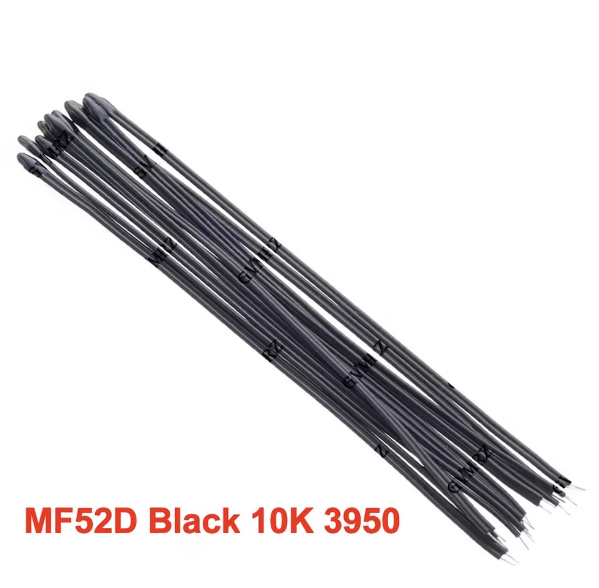
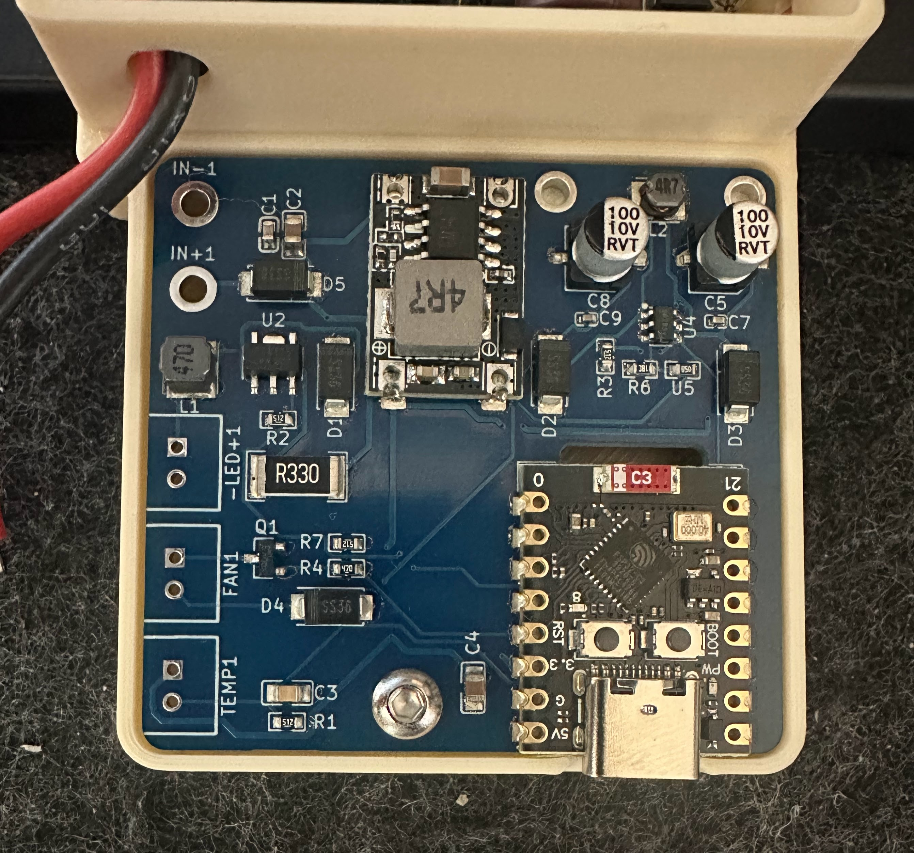
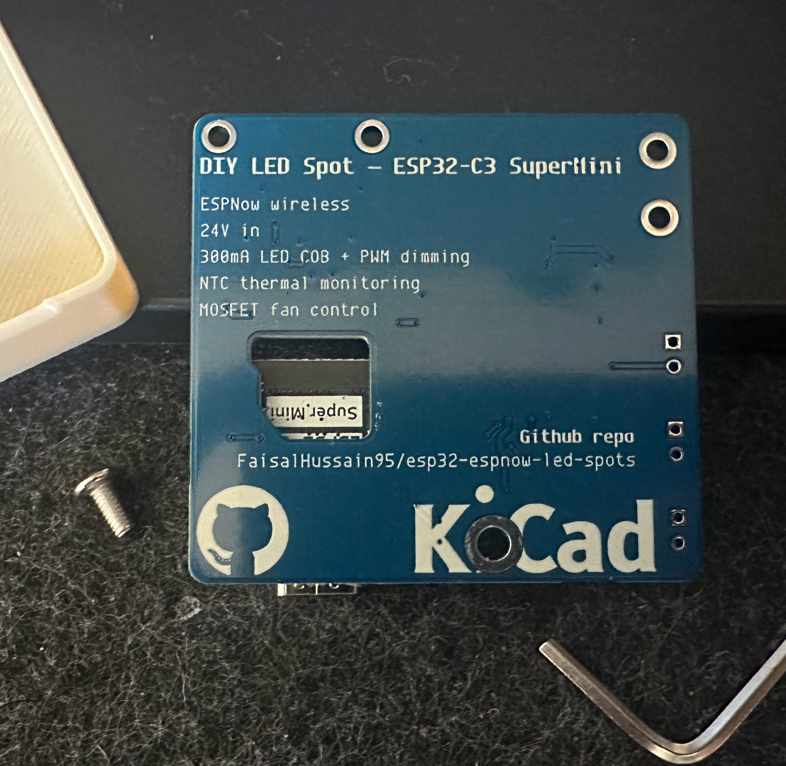

# DIY Smart LED Spot Replacement

Replacing 13 cheap 220V ceiling spots with custom COB LED units — dimmable, Home Assistant integrated, actively cooled, and wirelessly controlled over ESP-NOW.

---

## The problem

I have 13 recessed spots installed across my ceiling. They were cheap 220V AC units with no heatsink — just a bare aluminium PCB glued to a plastic shell.

Opening one up tells the whole story: the driver circuit runs directly off mains voltage with no thermal management whatsoever.

After about 5000 hours one by one they started dying from overheating. Rather than buying the same thing again, I decided to rebuild them properly.

---

## The goals

- **Reuse the existing shells** — no new ceiling holes
- **Use COB LEDs from stock** — 5W COB with a proper heatsink and active cooling to make them last
- **Dimmable** — the original spots were on/off only
- **Home Assistant integration** — via MQTT
- **OTA updates** — to add effects or fix bugs without a ladder (we already added a pulse effect and smooth fade in/out)
- **No per-spot WiFi** — 13 devices on the IoT network is too much; ESP-NOW keeps them off WiFi entirely

---

## Why not a simpler controller?

The ESP32 is overkill for dimming a light, I know. The constraint was the existing wiring in the ceiling: when it was first installed nobody thought about future upgrades, so we are stuck with the cables already there. Running a new PWM signal cable through the ceiling was not feasible. We needed a device that could receive wireless commands and that I already knew how to program — hence ESP32 + ESP-NOW.

---

## Power: from 220V mains to 24V DC

The original spots each had their own mains driver. The replacement approach uses a single shared 24V DC rail for all spots.

**Power supply: TRACO TSP 180-124 — 24V / 180W**

The supply sits centrally, with two cable runs of 15m each covering all spots.

### Cable sizing

Existing cable: 2.5mm² solid copper (13 AWG), already in the ceiling (previously carrying 220V).

- COB LED: ~7W max, running at PWM 160/255 → ~4.4W effective
- ESP32-C3: ~0.5W
- Budget per spot: **~12W to be safe** → total load: 13 × 12W = **156W / 24V = 6.5A** across the full 30m run
- Per 15m path: **max ~3A**

Using a [wire size calculator](https://www.omnicalculator.com/physics/wire-size) with 3A over 15m and a 10% voltage drop tolerance, 2.5mm² is sufficient. The cable was already there — we just repurposed it from 220V AC to 24V DC.

---

## The replacement unit

Each spot gets a self-contained module: COB LED + heatsink + fan + NTC + ESP32-C3 + custom PCB.

### COB LED on heatsink

### With fan mounted

The 25×25mm fan sits on top of the heatsink. It is 5V PWM-controlled, kicks in above 45°C and cuts off below 40°C. At normal brightness the fan rarely runs.

### NTC thermal protection

An MF52 10kΩ NTC is mounted against the heatsink. The firmware reads it every second and applies progressive PWM throttling at 60°C, a hard floor at 75°C, and alerts the master controller at 85°C.

---

## The PCB

The driver electronics sit on a custom KiCad board that fits inside the spot shell. It carries the MP1584 buck converter (24V → 3.3V), PT4115 LED driver, fan MOSFET, NTC input, and the ESP32-C3 SuperMini.

**Manufacturing files for JLCPCB** (Gerbers, BOM, CPL) are in [kicad/diy_led_spot/v4/](kicad/diy_led_spot/v4/). The KiCad project itself is in [kicad/diy_led_spot/](kicad/diy_led_spot/).

---

## How it works (briefly)

Each spot is an ESP32-C3 node. A TTGO LoRa32 acts as master. A third ESP32 bridges MQTT to the master over UART. The spots never touch WiFi during normal operation — everything runs over ESP-NOW on a dedicated channel.

For the full technical details, wiring, firmware architecture, and PCB design see [TECHNICAL.md](TECHNICAL.md).
